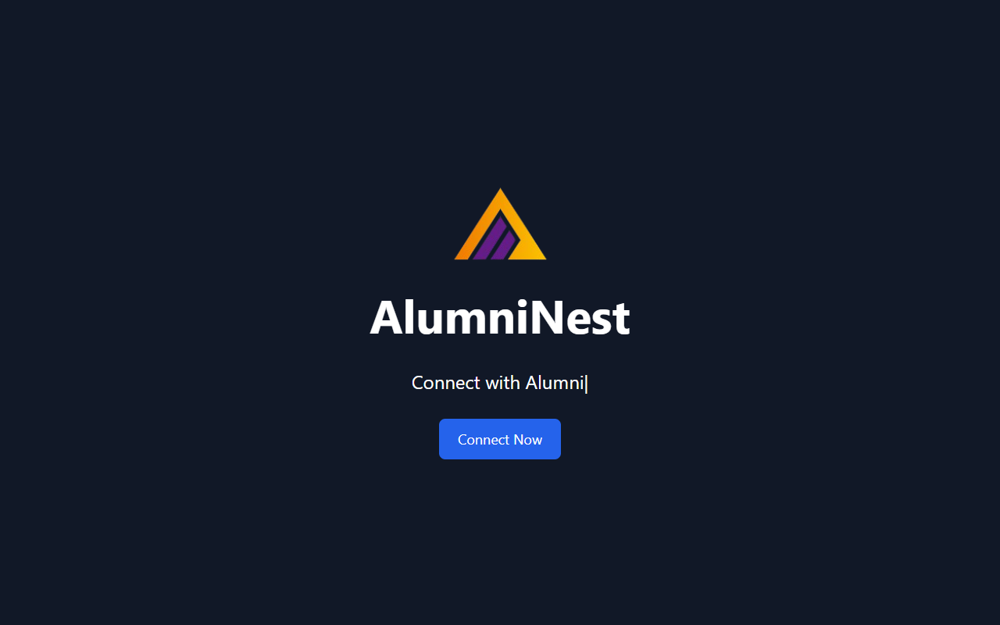
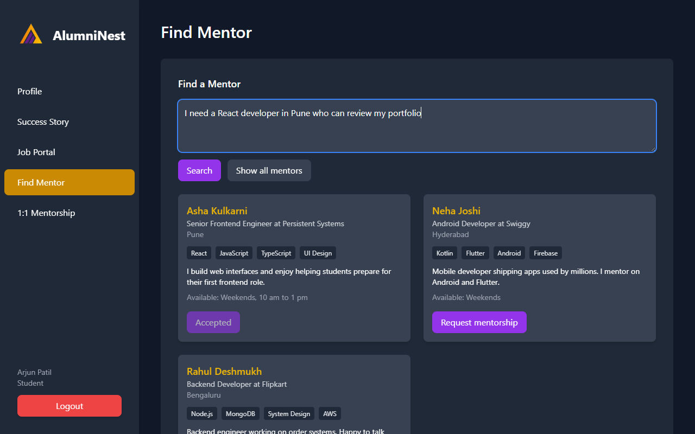
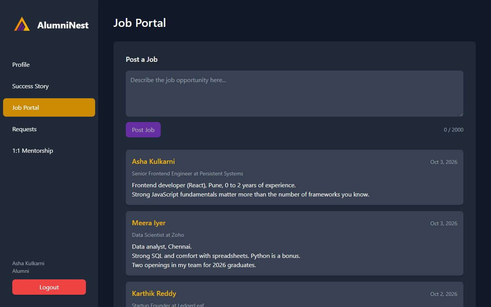
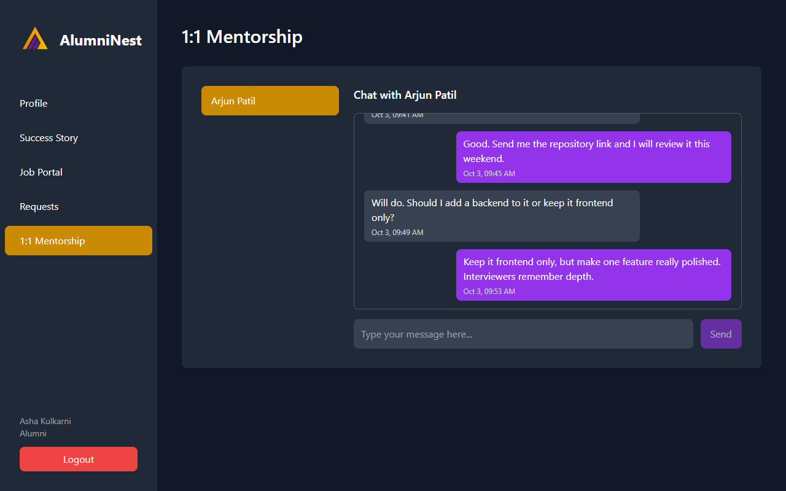
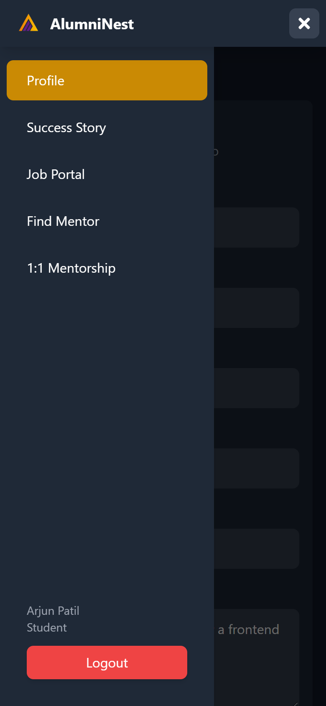
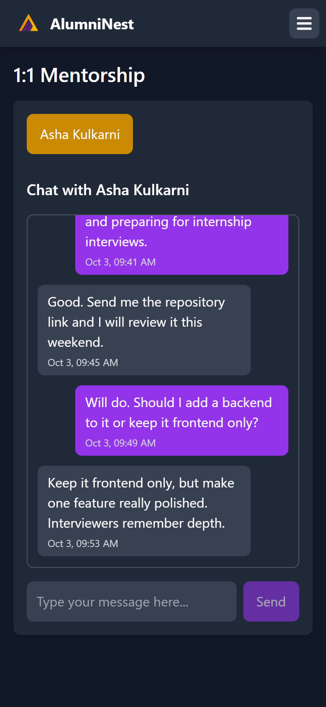

# AlumniNest

AlumniNest connects current students with alumni of their institute. Alumni
share success stories and job openings and offer one-to-one mentorship.
Students read those posts, search for a mentor, send a mentorship request and
chat with the mentor once the request is accepted.

The project started at the ScrollHack hackathon in September 2024.

## Live demo

**<https://scrollhack.vercel.app>**

Log in with a demo account to look around without signing up:

| Role | Email | Password |
|---|---|---|
| Alumnus | `asha.alumni@alumninest.demo` | `Demo@123` |
| Student | `arjun.student@alumninest.demo` | `Demo@123` |

- The people, companies, posts and conversations in the demo are sample data.
- The API runs on a free plan that sleeps when idle, so the first request can
  take up to a minute.
- You can also sign up with your own email address; a verification link is
  sent to it.

## Screenshots

**Landing page**



**Mentor search:** a student describes the mentor they need and gets ranked matches.



**Job portal:** alumni post openings; students read them.



**Live chat** between a mentor and a student.



**On a phone:** the sidebar becomes a menu, and chat fits the screen.

<p>
  
  &nbsp;&nbsp;
  
</p>

## Features

- **Accounts:** sign-up as a student or an alumnus, email verification, login,
  logout and password reset.
- **Profiles:** profession, field, skills, location and availability for
  alumni; field of study and interests for students.
- **Posts:** alumni publish success stories and job openings; everyone can
  read them.
- **Mentor search:** students describe the mentor they need in plain words and
  get alumni ranked by how well their skills, profession, field and location
  match.
- **Mentorship requests:** a student requests a mentor; the alumnus accepts or
  declines.
- **Live chat:** one-to-one messaging between a student and their mentor, with
  history.

## Tech stack

| Part | Stack |
|---|---|
| Frontend | React 18, Vite, Tailwind CSS, React Router, Axios, Socket.io client |
| Backend | Node.js, Express, MongoDB with Mongoose, JSON Web Tokens, Nodemailer, Socket.io |
| Tests | Jest, Supertest, in-memory MongoDB |

## Getting started

### Prerequisites

- Node.js 20 or newer
- A MongoDB connection string (local MongoDB or MongoDB Atlas)
- SMTP credentials for sending the verification and reset emails

### Setup

```bash
git clone https://github.com/samirsuroshe18/ScrollHack-Project.git
cd ScrollHack-Project

cd Backend
npm install
cp .env.example .env     # then fill in the values, see below

cd ../Frontend
npm install
```

### Environment variables

`Backend/.env`:

| Key | Purpose |
|---|---|
| `MONGODB_URI` | Database connection string |
| `PORT`, `SERVER_HOST` | Where the API listens (`3000`, `localhost`) |
| `CORS_ORIGIN` | Frontend origin (`http://localhost:5174`) |
| `FRONTEND_URL` | Base URL used in email links (`http://localhost:5174`) |
| `MAIL_HOST`, `EMAIL_PORT`, `MAIL_USER`, `MAIL_PASS` | SMTP settings |
| `BREVO_API_KEY`, `MAIL_FROM` | Optional. Send email through the Brevo HTTPS API instead of SMTP, from this verified sender |
| `ACCESS_TOKEN_SECRET`, `ACCESS_TOKEN_EXPIRY` | Access token signing, for example a long random string and `1d` |
| `REFRESH_TOKEN_SECRET`, `REFRESH_TOKEN_EXPIRY` | Refresh token signing, for example a long random string and `10d` |

### Run

Start the API and the web app in two terminals:

```bash
cd Backend
npm run dev
```

```bash
cd Frontend
npm run dev
```

Open <http://localhost:5174>. The web app proxies `/api` and `/socket.io` to
the API on port 3000.

### Deployment

The API and the web app can be hosted separately, for example the API on Render and the
web app on Vercel.

**API**

- Root directory `Backend`, build command `npm install`, start command `npm start`.
- Set the variables from `Backend/.env.example`, with `NODE_ENV=production` and
  `SERVER_HOST=0.0.0.0`. Leave `PORT` to the host if it provides one.
- `CORS_ORIGIN` and `FRONTEND_URL` are the public address of the web app.
- If the host blocks outgoing mail ports, set `BREVO_API_KEY` and `MAIL_FROM` so email is
  sent over HTTPS.

**Web app**

- Root directory `Frontend`, build command `npm run build`, output directory `dist`.
- `Frontend/vercel.json` forwards `/api` to the API, so the login cookie stays on the web
  app's own address. Change the destination there if the API lives elsewhere.
- Set `VITE_SOCKET_URL` to the API's address. Chat connects to it directly, using a
  short-lived token from `GET /api/v1/users/chat-token`.

### Demo data

```bash
cd Backend
npm run seed
```

This fills the database with sample alumni and students, their profiles, posts,
mentorships and a short conversation. Every demo account uses the password
`Demo@123`, for example:

| Role | Email |
|---|---|
| Alumnus | `asha.alumni@alumninest.demo` |
| Student | `arjun.student@alumninest.demo` |

The script only removes and recreates accounts under `@alumninest.demo`, so it
can be run again at any time.

### Tests

```bash
cd Backend
npm test
```

The tests start their own in-memory database and never send email.

## Project structure

```
Backend/
  src/
    app.js            Express app, routes and error handling
    index.js          Starts the HTTP and Socket.io server
    socket.js         Chat events
    controller/       Request handlers
    middlewares/      Authentication and role checks
    models/           User, Post, Mentorship, Message
    routes/           Route definitions
    utils/            Mail sender, mentor search, helpers
    scripts/seed.js   Demo data
  tests/              API and chat tests
Frontend/
  src/
    api/              Axios client
    context/          Login state
    components/       Pages, dashboards and shared pieces
    data/             Static lists
docs/
  design.md           Design of the application
```

## API overview

All routes are under `/api/v1`.

| Area | Routes |
|---|---|
| Accounts | `POST /users/register`, `POST /users/login`, `GET /users/logout`, `GET /users/me`, `PATCH /users/me`, `GET /users/chat-token`, `POST /users/forgot-password` |
| Email links | `GET /verify/verify-email`, `GET /verify/reset-password`, `POST /verify/verify-password` |
| Posts | `GET /posts`, `POST /posts` |
| Mentors | `GET /mentors`, `GET /mentors/search?q=` |
| Mentorships | `POST /mentorships`, `GET /mentorships`, `PATCH /mentorships/:id`, `GET /mentorships/:id/messages` |

Chat uses the Socket.io events `chat:join`, `chat:send` and `chat:message`.
See [docs/design.md](docs/design.md) for details.

## Team

Built by Samir Suroshe ([@samirsuroshe18](https://github.com/samirsuroshe18)),
Mohit Dhangar ([@mohit45v](https://github.com/mohit45v)) and
Tanishq Kulkarni ([@tanishqbuilds](https://github.com/tanishqbuilds)).

## License

[MIT](LICENSE)
